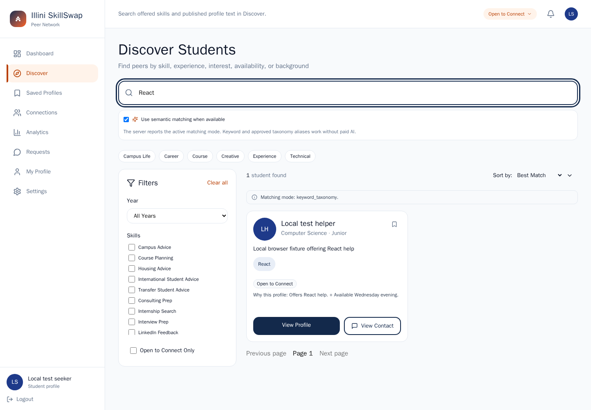

# UIUC SkillShare

Find Illinois peers offering a skill, request help, and connect after they accept.

## Demo / Screenshots



[Mobile screenshot](docs/screenshots/discovery-mobile.png) · [Verified browser journey](docs/browser-verification.md) · [Readiness evidence](docs/readiness.md). Screenshots use synthetic local profiles; no public deployment is claimed.

## What it does

An Illinois-email member can publish offered skills and evidence links, discover a suitable peer, request help, share selected contacts after acceptance, and leave feedback after completion. Account access does not establish university approval or verified current enrollment.

## Key features

- Google or expiring email-code sign-in with server-controlled sessions.
- Separate offered skills and learning goals; explainable, paginated recommendations.
- Consent-based contacts, private profiles, blocking/reporting and account export/deletion.
- Transactional requests, verified-interaction reviews and persistent notifications.

## Architecture / Tech stack

```text
React / TypeScript browser → Django REST + static frontend → PostgreSQL / pgvector
                                      └── Redis / RQ worker → email / avatar cleanup
```

Django authorizes every peer operation. Local email uses Mailpit. Supabase PostgreSQL/private Storage integration is prepared for future hosting. [Matching design](docs/matching.md) explains ranking; paid semantic calls default to disabled.

## Quick start

Install Docker with Compose v2 and allocate about 4 GB of memory:

```sh
git clone https://github.com/adhvikrayaprolu/uiuc-skillshare.git
cd uiuc-skillshare
cp .env.example .env
docker compose up --build --wait
```

Open **http://localhost:8080**. Sign in with an Illinois email and read its code at **http://localhost:8025**, the local test inbox. This inbox simulates delivery; it does not verify real mailbox ownership. Google needs your own OAuth client. Startup migrates the database and seeds approved taxonomy, **never member accounts**.

## Configuration

`.env.example` has safe local defaults. Never commit real environment files. Local Compose is for development; future HTTPS hosting uses the separate [production configuration and Supabase runbook](docs/operations.md). AI remains disabled with a $0 call allowance.

## Testing

```sh
make check
```

Runs PostgreSQL regressions, schema/migration checks, frontend tests/lint/types/build, the two-member Chromium journey with accessibility checks, production-settings checks, database permission checks and a disposable backup/restore rehearsal. Requires Make and Python 3 on the host. CI uses this same command on every PR, including stacked PRs, plus dependency audits.

`docker compose down` stops services while preserving data. See [development](docs/development.md) for logs, native editing and deliberately disposable resets.

## API / Project structure

[API contract](backend/docs/frontend_api_contract.md) · local API explorer: `/api/docs/`.

- `frontend/src/`: pages, shared components, API clients and tests.
- `backend/`: accounts, profiles, taxonomy, discovery, interactions and jobs.
- `scripts/database/`: role preparation and local migration/recovery rehearsal.
- `docs/`: matching, browser evidence and operations.

## Design decisions / Known limitations

Contacts stay external; real-time chat, booking and credential-document uploads are deferred. Skills are self-declared; feedback confirms an interaction, not independently verified expertise. Retrieval bounds candidates to 200 and reports that limit. Paid embedding adapters are tested with fixtures; live semantic quality is unverified.

## Future work

Review the [issue-linked draft PR stack](https://github.com/adhvikrayaprolu/uiuc-skillshare/issues/5), then separately authorize hosting and verify Google, SMTP and hosted Supabase. No deployment or paid AI usage is included in this milestone.
